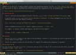
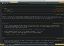

<!-- +++
Area = "projects"
GitHub = "md2vim"
Layout = "page"
Tags = ["blackfriday", "golang", "markdown", "md2vim", "vim", "mit license"]
Description = "Tool for automatically converting markdown to vimdoc format."
Collection = "ProjectsComplete"
+++ -->

# Md2Vim

Writing technical documentation for Vim extensions is not exciting; manually converting what you've just written in
[Markdown](https://daringfireball.net/projects/markdown/) to
[Vimdoc](http://vimdoc.sourceforge.net/htmldoc/usr_toc.html) format is even less fun. I grew tired of having to do this
repeatedly for my [Vim-ArgWrap](https://foosoft.net/projects/vim-argwrap/) extension and finally formally solved this
problem with a purpose-built tool. Maintainability, ease of use, and beautiful Vimdoc output were primary considerations
in Md2Vim's design.

[](img/markdown.png)
[](img/vimdoc.png)

## Installation

If you already have the Go environment and toolchain set up, you can get the latest version by running:

```
$ go get github.com/FooSoft/md2vim
```

Otherwise, you can use the [pre-built binaries](https://github.com/FooSoft/md2vim/releases) from the project page.

## Usage

Executing Md2Vim with the `-help` command line argument will trigger online help to be displayed. The list below
provides a more detailed description of what the parameters do.

*   `cols`

    The number of columns used for laying out Vimdoc files to make them look as good as possible with your content.
    Notice that file contents will not be wrapped to this value; this is purely for such things as horizontal rule
    widths and help tag positioning. This defaults to 80, but that's a bit too narrow for some people.

*   `desc`

    Vim help files are supposed to start with the following two fields on the first line:

    ```
    filename.txt Description of this help file's contents
    ```

    The first field is the filename of the generated Vimdoc help file; the second is the description can you provide
    with this parameter.

    Multi line description can be written using `\n`.

*   `norules`

    By default, we generate horizontal rules above level 1-2 headings, as shown below:

    ```
    ================================================================================
    Level 1 Heading
    --------------------------------------------------------------------------------
    Level 2 Heading
    ```
    If you don't like the way it looks you can turn it off.

*   `notoc`

    If you don't wish to generate a table of contents you should set this flag to opt out. The table of contents lists
    all of the headings in the document and is always inserted before the beginning of document body.

*   `pascal`

    By default, all help tags get converted to lower case and space delimited words are joined with underscores.

    ```
    rigellians-how_to_cook_for_fourty_humans
    ```

    If you prefer the PascalCase way of doing things, set this flag and your output will look like this:

    ```
    Rigellians-HowToCookForFourtyHumans
    ```

*   `tabs`

    If you don't like four space tabs for some reason you can change it to something else with this parameter.
